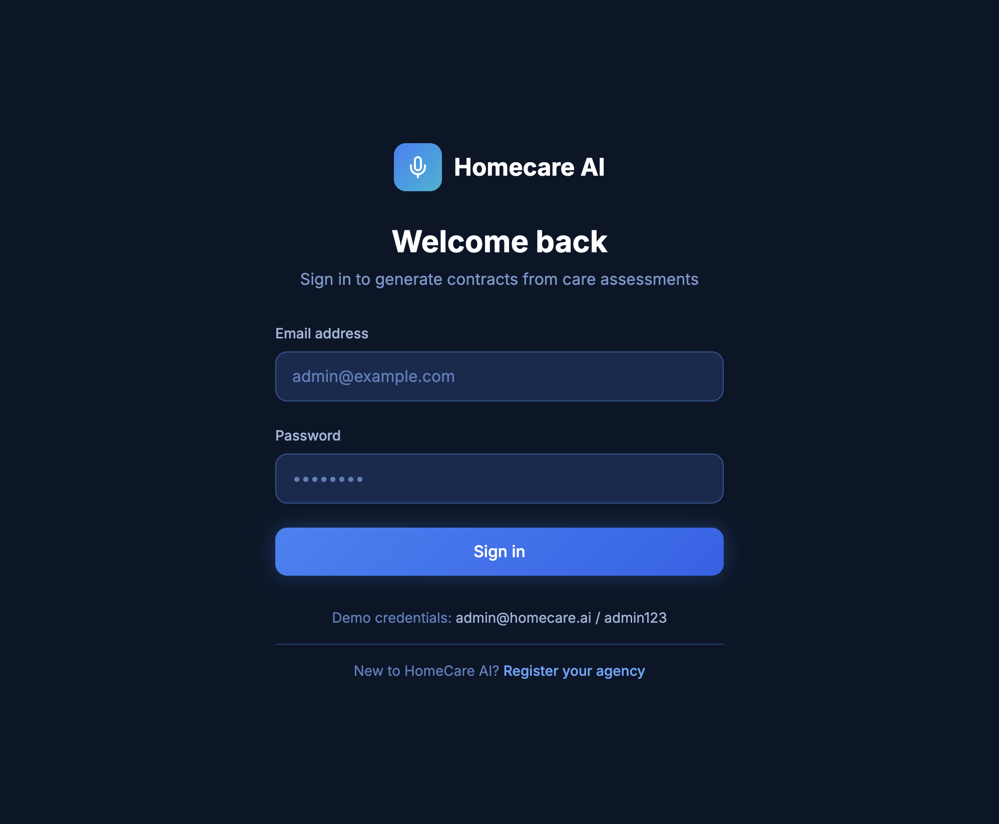
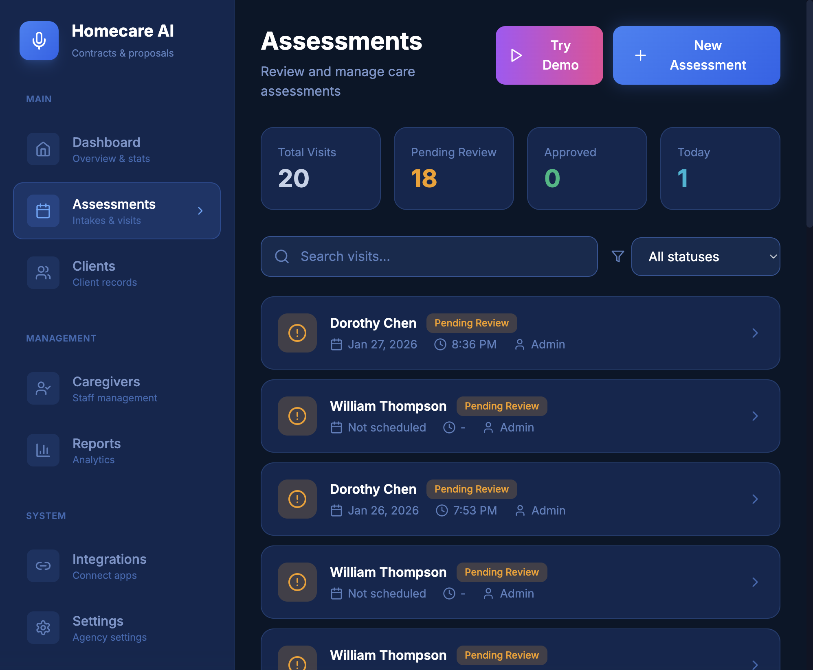
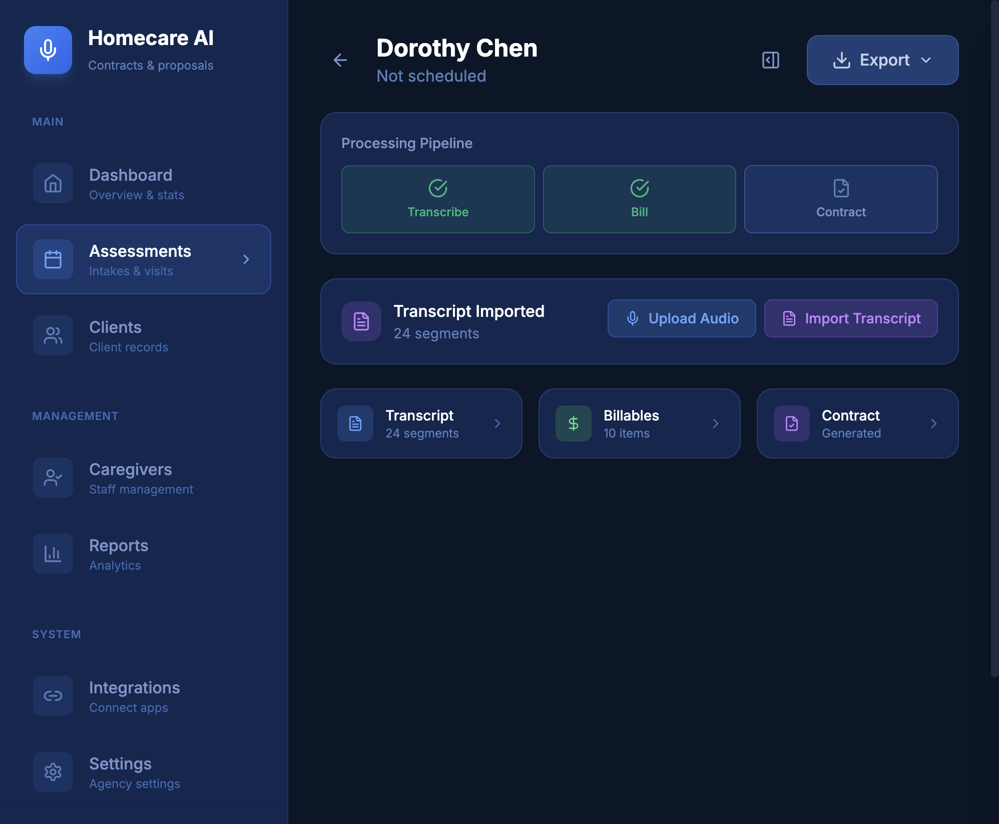
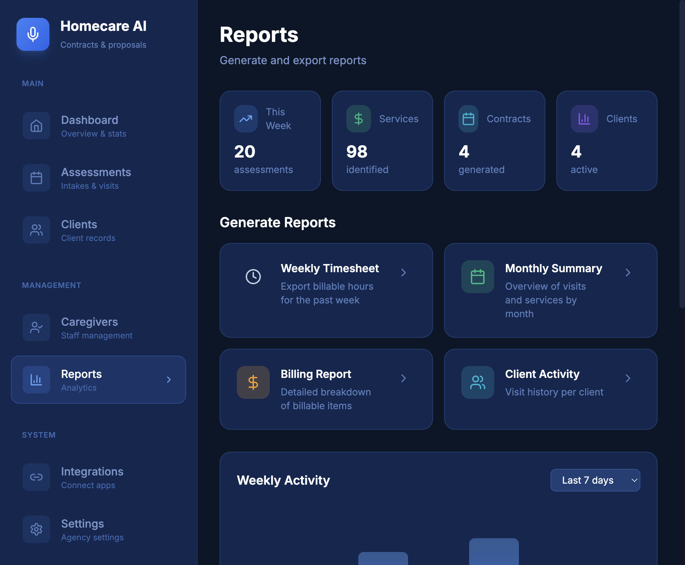

# Homecare AI

## Care assessments in, proposal-ready contracts out.

**AI-powered workflow for home healthcare agencies** that turns intake/visit conversations (audio or transcripts) into **draft service contracts, billables, and SOAP notes** — with human-in-the-loop review.

---

## The Problem

Home healthcare agencies face critical operational challenges:

- **Slow**: Intake calls → manual notes → manual pricing → manual contract drafting takes hours
- **Inconsistent**: Variability across coordinators/branches leads to **pricing and scope errors**
- **High-stakes**: Delays and mistakes cost **revenue, compliance risk, and client trust**
- **Documentation burden**: Care professionals spend more time on paperwork than patient care

---

## The Solution

Homecare AI converts a conversation into structured outputs in minutes:

| Input | AI Processing | Output |
|-------|--------------|--------|
| Audio recording or transcript | Speech-to-text, Speaker identification, Service extraction | Transcript with speaker labels |
| Services mentioned | Category-based billing rules | Billable items with pricing |
| Care assessment data | Template merging | Draft service contract |
| Visit notes | SOAP format generation | Clinical documentation |

---

## Demo: Login



**Secure multi-tenant access** — Each agency gets their own isolated environment with role-based permissions.

---

## Assessments Dashboard



### Key Features:
- **Work queue** — See all pending assessments at a glance
- **Status tracking** — Pending Review, Approved, Today's count
- **Quick filters** — Search by client, status, or date
- **One-click demo** — Try the full pipeline without setup

---

## Assessment Pipeline



### Processing Pipeline:
1. **Transcribe** — Upload audio or import text transcript
2. **Bill** — AI extracts services and applies billing rules
3. **Contract** — Generate draft contract from templates

### Data Views:
- **Transcript** — Full conversation with speaker identification
- **Billables** — Extracted services with pricing
- **Contract** — Generated service agreement

---

## Contract Generation


### Human-in-the-Loop Review:
- **Preview** — See the generated contract before export
- **Edit** — Make manual adjustments as needed
- **Regenerate** — Re-run AI with different parameters
- **Print/Export** — PDF export for client signature

### Auto-populated fields:
- Agency information, Client details, Services, Pricing, Terms

---

## Client Management (CRM)


### Client Database:
- **Care levels** — High Care, Standard, etc.
- **Medical conditions** — Track diagnoses and needs
- **Emergency contacts** — Always accessible
- **Visit history** — Full assessment timeline

### Quick Actions:
- Add new clients, Search/filter, Export data

---

## Reports & Analytics



### Operational Reports:
- **Weekly Timesheet** — Export billable hours
- **Monthly Summary** — Visits and services overview
- **Billing Report** — Revenue breakdown
- **Client Activity** — Per-client visit history

### Dashboard Metrics:
- Assessments this week, Services identified, Contracts generated, Active clients

---

## NEW: Voice Identification

### Problem Solved:
AI couldn't reliably identify who was speaking in recordings

### Solution: Voiceprint Technology
1. **Staff records voice sample** (30 seconds)
2. **AI creates unique voiceprint** 
3. **Auto-identifies assessor** in every recording
4. **Names extracted from conversation** for clients

### Benefits:
- Accurate speaker attribution
- No introductions needed
- Works across all recordings

---

## NEW: SOAP Notes Generation

### Automatic Clinical Documentation:

| Section | Content |
|---------|---------|
| **Subjective** | Client's reported symptoms, concerns |
| **Objective** | Observable findings, vital signs |
| **Assessment** | Clinical evaluation summary |
| **Plan** | Recommended care plan, follow-ups |

### Additional Data:
- Tasks performed with duration
- Client responses
- Narrative summary

---

## NEW: Pipeline/Deals Board

### Visual Client Journey:

```
Intake → Assessment → Proposal → Active → Completed
  📋         🔍          📝        ✅        🏁
```

### Features:
- **Kanban view** — Drag-and-drop status updates
- **Monthly value** — Revenue tracking per stage
- **Contract status** — Ready/Not Ready indicators
- **Quick actions** — View client, send proposal

---

## NEW: Automations

### Workflow Automations:
- ✅ Auto-generate contract when billing completes
- ✅ Notify coordinator when assessment is ready
- ✅ Update client status after contract generation
- ✅ Send reminder for unsigned contracts

### Coming Soon:
- Email templates for proposals
- Calendar scheduling integration
- Follow-up task creation

---

## Technical Architecture

```
┌─────────────────────────────────────────────────────────┐
│                    Frontend (Next.js)                     │
│         Modern React UI with real-time updates            │
├─────────────────────────────────────────────────────────┤
│                    API (FastAPI)                          │
│         RESTful endpoints, JWT auth, webhooks             │
├─────────────────────────────────────────────────────────┤
│              AI Pipeline (Celery Workers)                 │
│   Whisper → Pyannote → Claude → Template Engine           │
├─────────────────────────────────────────────────────────┤
│                   Data Layer                              │
│         PostgreSQL (entities) + S3 (audio files)          │
└─────────────────────────────────────────────────────────┘
```

---

## AI Pipeline Deep Dive

### Speech Processing:
- **Whisper** — Industry-leading transcription accuracy
- **Pyannote** — Speaker diarization (who spoke when)
- **Voiceprints** — Staff identification by voice

### Intelligence Layer:
- **Claude** — Service extraction, name identification
- **Category billing** — Rule-based pricing engine
- **Template merge** — DOCX contract generation

---

## Business Model

### Subscription Tiers:

| Plan | Price | Includes |
|------|-------|----------|
| Starter | $99/mo | 50 visits, 3 users |
| Professional | $249/mo | 200 visits, 10 users |
| Enterprise | Custom | Unlimited, API access |

### Additional Revenue:
- Onboarding setup fee
- Custom integrations
- Template customization

---

## Target Market

### Primary: Home Healthcare Agencies
- 25,000+ agencies in the US
- $142B market size
- 8% annual growth

### Pain Points We Solve:
- Documentation overhead (40% of admin time)
- Contract turnaround (days → minutes)
- Billing accuracy (reduces errors by 80%)

---

## Competitive Advantage

| Feature | Homecare AI | Traditional | Other AI |
|---------|-------------|-------------|----------|
| Audio → Contract | ✅ | ❌ | Partial |
| Speaker ID | ✅ Voiceprints | ❌ | Basic |
| SOAP Notes | ✅ Auto-gen | Manual | ❌ |
| Billing Rules | ✅ Category-based | Manual | Basic |
| Templates | ✅ DOCX support | ❌ | Limited |

---

## Roadmap

### Q1 2026 (Current)
- ✅ Core pipeline (transcribe, bill, contract)
- ✅ Voice identification
- ✅ SOAP notes generation
- ✅ Pipeline/CRM integration

### Q2 2026
- 📋 EMR/EHR integrations
- 📋 Multi-location analytics
- 📋 Mobile app for field recording

### Q3 2026
- 📋 Billing system integrations
- 📋 Compliance audit trails
- 📋 White-label offering

---

## Team

### Core Team:
- Founder with healthcare + AI background
- Full-stack development expertise
- Healthcare industry advisors

### Technology Partners:
- OpenAI (Whisper transcription)
- Anthropic (Claude intelligence)
- Pyannote (Speaker diarization)

---

## Traction

### Metrics:
- **MVP completed** with full pipeline
- **20+ assessments** processed in demo
- **98+ services** automatically identified
- **4 contracts** generated end-to-end

### Feedback:
- "This would save us 2-3 hours per assessment" — Home Care Coordinator
- "Finally, accurate speaker identification" — Agency Owner

---

## The Ask

### Seeking: Seed Investment

### Use of Funds:
- **Product** — Enhanced AI accuracy, mobile app
- **Go-to-Market** — Sales, marketing, onboarding
- **Team** — Engineering, customer success

### Why Now:
- AI technology matured for healthcare use
- Increasing documentation requirements
- Labor shortage driving automation demand

---

## Contact

### Homecare AI

**Website**: [homecare.ai](https://homecare.ai)
**Demo**: [web-production-11611.up.railway.app](https://web-production-11611.up.railway.app)
**Email**: contact@homecare.ai

---

# Thank You

## Questions?
